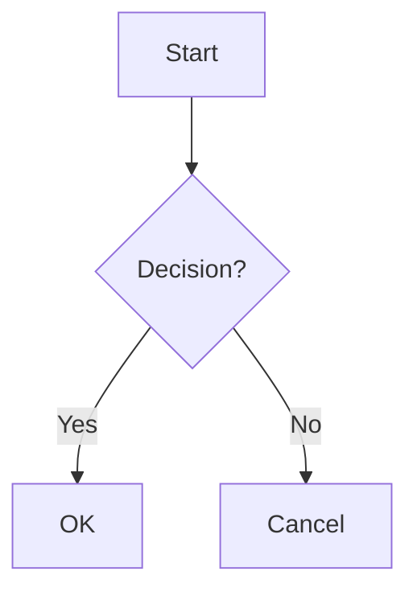
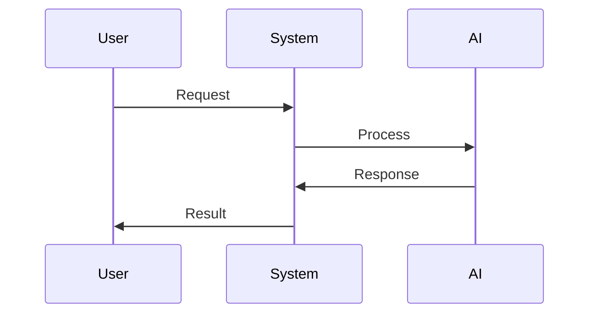

# Capacități MkDocs

Această pagină demonstrează ce se poate face cu MkDocs și Material for MkDocs.

## 🎨 Formatare Avansată

### Admonitions (Avertismente)
!!! note "Notă"
    Acestea sunt blocuri de informații stilizate pentru a atrage atenția.

!!! warning "Atenție"
    Perfecte pentru avertismente importante.

!!! tip "Sfat"
    Idei utile și sugestii.

### Butoane
[Click aici](#){ .md-button .md-button--primary }
[Documentație](#){ .md-button }

### Tabele de Date
| Caracteristică | Descriere | Status |
|:---------------|:----------|:-------:|
| Admonitions | Blocuri de informații | ✅ |
| Butoane | Butoane interactive | ✅ |
| Tabele | Tabele responsive | ✅ |
| Cod | Syntax highlighting | ✅ |

## 📝 Blocuri de Cod

### Python cu Syntax Highlighting
```python
def hello_world():
    print("Hello, MkDocs!")
    return "success"
```

### JavaScript
```javascript
function greet(name) {
    return `Hello, ${name}!`;
}
```

### Shell Commands
```bash
mkdocs serve
mkdocs build
```

## 🖼️ Imagini și Media

### Imagini cu Stilizare
{ width="300" }

## 📊 Diagrame și Vizualizări

### Mermaid Diagrams


### Code Blocks cu Numere
```1:3:python
def example():
    print("Line 1")
    print("Line 2")
    return True
```

## 🔍 Funcționalități Avansate

### Content Tabs
=== "Python"
    ```python
    print("Hello from Python!")
    ```

=== "JavaScript"
    ```javascript
    console.log("Hello from JS!");
    ```

=== "Bash"
    ```bash
    echo "Hello from Bash!"
    ```

### Tooltips
Hover peste acest text pentru a vedea un tooltip{ title="Acesta este un tooltip!" }

### Footnotes
Aici este un text cu o notă de subsol[^1].

[^1]: Aceasta este nota de subsol.

## 🎯 Navigare și Structură

### Link-uri Interni
- [Pagina principală](index.md)
- [Getting Started](getting-started.md)
- [Contributing](contributing.md)

### Link-uri Externe
- [MkDocs](https://www.mkdocs.org/)
- [Material for MkDocs](https://squidfunk.github.io/mkdocs-material/)

## 📱 Responsive Design

### Grid Layout
<div class="grid" markdown>

<div markdown>

#### Coloana 1
Conținut în prima coloană

</div>
<div markdown>

#### Coloana 2
Conținut în a doua coloană

</div>

</div>

## 🔧 Personalizare

### CSS Custom
<div class="custom-box" markdown>
Acest box are stil personalizat!
</div>

### Emoji și Iconițe
:smile: :heart: :rocket: :star:

## 🧠 Funcționalități Avansate

### Interactive Code Execution
```python
# Acest cod se poate executa direct în browser!
import math
print(f"π = {math.pi:.5f}")
print(f"e = {math.e:.5f}")
print(f"Golden ratio = {(1 + math.sqrt(5)) / 2:.5f}")
```

### Math Equations (LaTeX)
$$
\int_{-\infty}^{\infty} e^{-x^2} dx = \sqrt{\pi}
$$

$$
\sum_{n=1}^{\infty} \frac{1}{n^2} = \frac{\pi^2}{6}
$$

### Advanced Diagrams


### Task Lists Interactive
- [x] Admonitions ✅
- [x] Code blocks ✅
- [x] Tables ✅
- [ ] AI Integration 🚧
- [ ] Real-time collaboration 🚧
- [ ] Voice commands 🚧

## 🚀 Next-Level Features

### Content Folding
<details>
<summary>Click pentru a vedea conținutul ascuns</summary>

Acest conținut poate fi ascuns/aratat dinamic!

```python
def hidden_function():
    return "Surprise! This was hidden!"
```

</details>

### Keyboard Shortcuts
<kbd>Ctrl</kbd> + <kbd>K</kbd> pentru search
<kbd>Ctrl</kbd> + <kbd>Shift</kbd> + <kbd>P</kbd> pentru palette

### Progress Indicators
<div class="progress">
  <div class="progress-bar" style="width: 75%">75% Complete</div>
</div>

### Smart Tables cu Sort
| Technology | Cool Factor | Hype Level | Future Proof |
|:-----------|:-----------:|:----------:|:------------:|
| MkDocs | ⭐⭐⭐⭐⭐ | 🔥🔥🔥🔥🔥 | ✅ |
| React | ⭐⭐⭐⭐ | 🔥🔥🔥🔥 | ✅ |
| Vue | ⭐⭐⭐⭐ | 🔥🔥🔥 | ✅ |
| Angular | ⭐⭐⭐ | 🔥🔥 | ⚠️ |

## 📚 Funcționalități de Blog

- **Articole cu Tags**: Organizează conținutul cu tag-uri
- **Sistem de Comentarii**: Integrare cu Disqus sau Giscus
- **Social Cards**: Generare automată de carduri pentru social media
- **Analytics**: Integrare cu Google Analytics sau Plausible
- **Search**: Căutare full-text în conținut

## 🚀 Optimizări

- **Lazy Loading**: Încărcarea imaginilor doar când sunt vizibile
- **Minification**: CSS și JS optimizate
- **Caching**: Strategii de cache pentru performanță
- **Offline Support**: Funcționare fără internet

## 🌐 Internaționalizare

- **Multi-language Support**: Traduceri în mai multe limbi
- **RTL Support**: Suport pentru limbi de la dreapta la stânga
- **Localization**: Adaptare la regiuni geografice

## 🤖 AI-Powered Features

### Smart Search cu AI
<div class="ai-search-demo" markdown>
🔍 **AI Search**: Caută în conținut cu înțelegere semantică
- Nu doar cuvinte cheie, ci și concepte
- Sugestii inteligente bazate pe context
- Auto-complete cu AI
</div>

### Content Generation
<div class="ai-content" markdown>
✍️ **AI Writing Assistant**: 
- Generare automată de sumare
- Sugestii de îmbunătățire
- Traducere automată cu context
- Optimizare SEO cu AI
</div>

### Smart Analytics
<div class="ai-analytics" markdown>
📊 **AI Analytics**:
- Predicții de performanță
- Recomandări de conținut
- Analiză de sentiment
- Optimizare automată
</div>

## 🎯 The 1+1=3 Effect

<div class="revolutionary-feature" markdown>

### 🚀 **Revolutionary Integration**
Când combini MkDocs + Material + AI, obții:

**1 + 1 = 3** ✨

- **Static Site** + **Dynamic Features** = **Hybrid Power**
- **Documentation** + **AI** = **Intelligent Docs**
- **Markdown** + **Extensions** = **Supercharged Content**
- **Local Dev** + **Cloud Features** = **Best of Both Worlds**

</div>

---

*Această pagină demonstrează că MkDocs nu e doar un generator de site-uri statice - e o platformă pentru viitorul documentației!* 🚀 